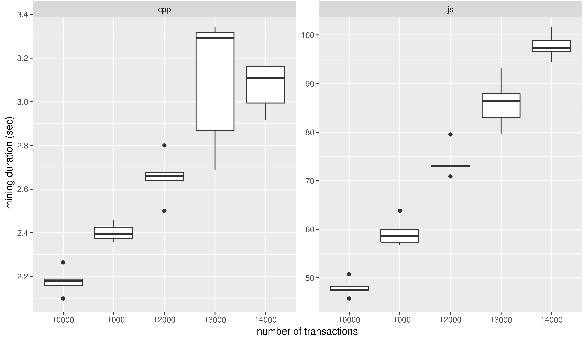
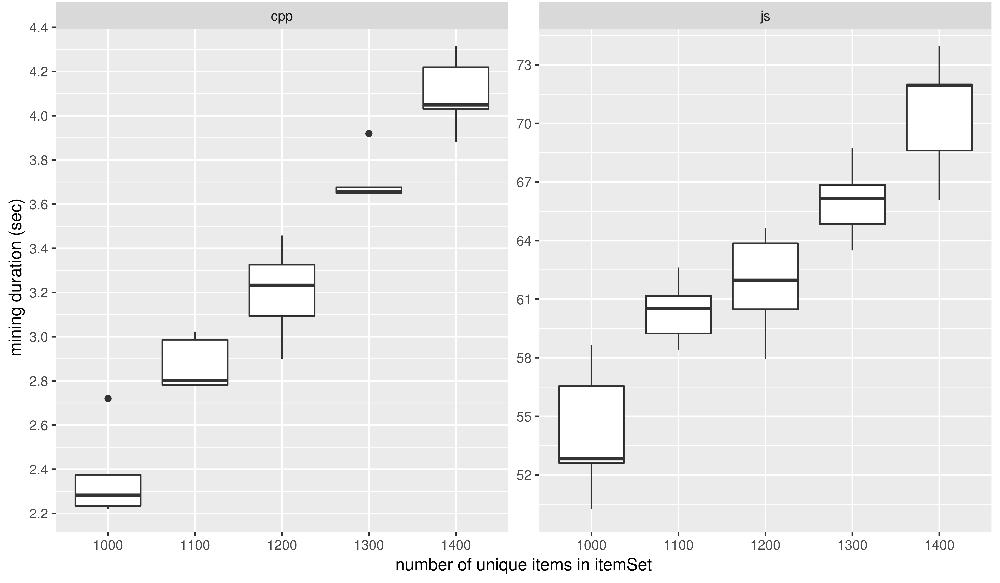

# Simple Recommendation Engine
- Package for Node.JS
- Implementation of Apriori-like algorithm for mining associations for given antecedent
- Computation in `C++`

# Motivation
- Node.JS is a production ready framework/engine
- Parallel Call Stack
- Ability to parallelize process (fork, spawn etc.)
- C++ integration makes data processing algorithms to perform faster than most of the HLLs
- Following benchmark that shows with what factor C++ performs computation than in native JS

## Benchmark
The following benchmark was performed on Ubuntu 16.04 with Node 10.13.0.
### Transactions Growth


### Itemset Growth

<!--  -->

# Usage
## `mine` API
### Syntax
```js
Function (Transaction, Options)
Transaction: Number[][]
Options: {
  antecedent: Number,
  sortingMeasure: String, // default: 'confidence'
  attachMeasures: Boolean // default false
}
```

### Sorting measures
Supply one of the following values as `String` for `sortingMeasure` parameter in `Options`. If `attachMeasures` is set to `true`, all the following measures are calculated and returned in response, and sorting of associations is done with the `sortingMeasure`.
- `confidence`
- `lift`
- `improvedLift`
- `kulc`
- `imbalanceRatio`
- `biConfidence`
- `biImprove`
- `jaccard`
- `conviction`
- `sebagSchoenauer`
- `certaintyFactor`
- `lift`
- `improve`

Note that, currently this package supports only numeric itemset as an array of transactions, where each transaction is an individual array. 

### Example Usage
```js
const mine = require('apriorijscpp');
const assocs = mine([
  [3, 10],
  [3, 4, 5],
  [3, 4, 5],
  [3, 4],
  [1, 2],
  [3],
  [3, 4, 1],
  [1, 2],
  [7, 8, 9]
], { 
  antecedent: 3,
  sortingMeasure: 'lift'
});

console.log(assocs);
```

# ToDo
- Compatibility for newer versions of node.js (newer N-API, breaking changes)
- Parallelization with child process handling
- Add contribution guide
- Add support for string based itemset

# Contribution

